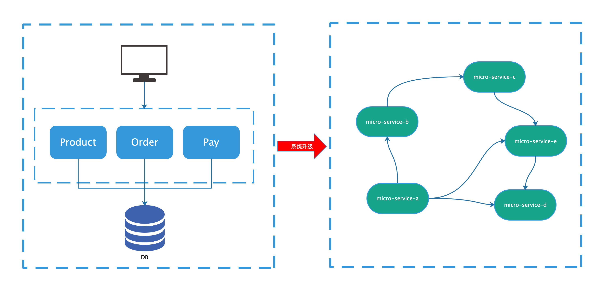
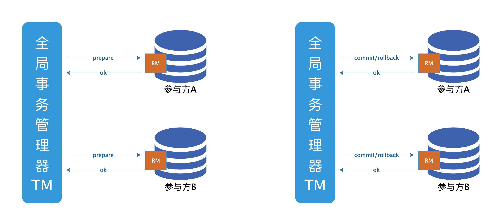
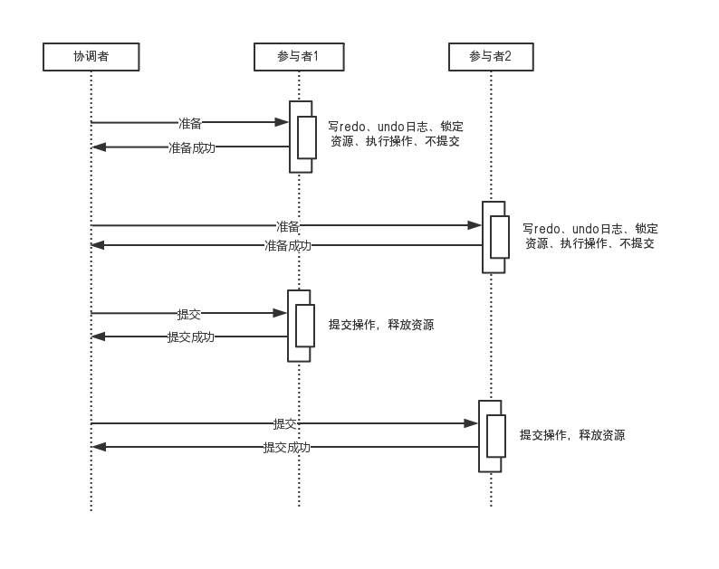
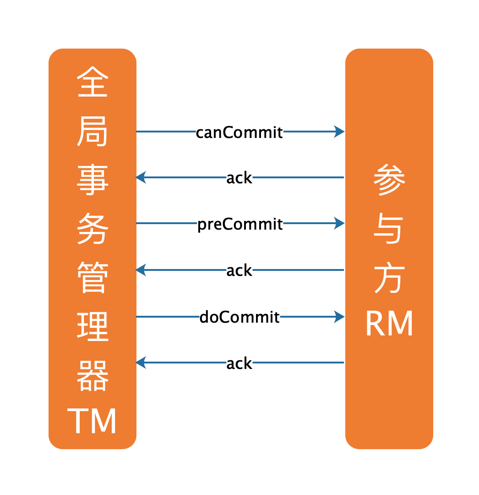
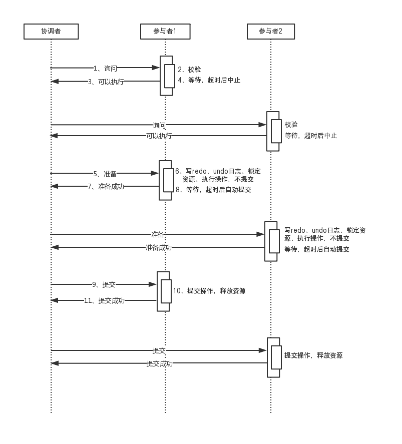
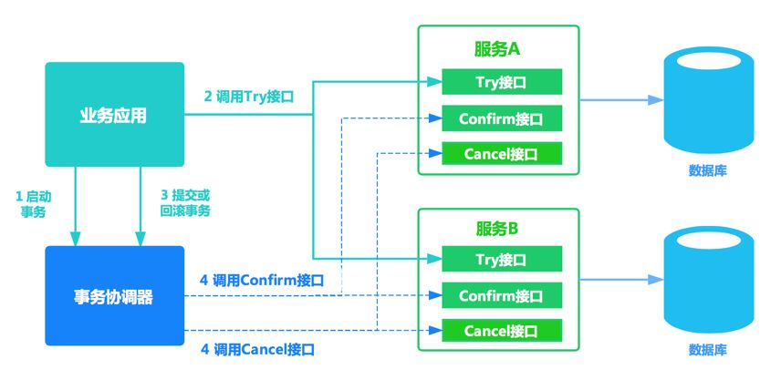

# 分布式事务

本次课程重点：

1. **tx-lcn**

## 1、概念介绍

### 1.1 本地事务

事务（Transaction），一般是指要做的或所做的事情。在DB中，可以理解为一条或者是一组语句组成一个单元，这个单元要么全部执行，要么全不执行。

事务具有四个特性，也是面试常考的四个特性ACID：

- A（原子性Atomicity）：原子性指的是事务是一个不可分割的，要么都执行要么都不执行。

- C（一致性Consistency）：事务必须使得数据库从一个一致性状态，到另外一个一致性状态。

- I（隔离性Isolation）：指的是一个事务的执行，不能被其他的事务所干扰。

- D（持久性Durability）：持久性指的是一个事务一旦提交了之后，对数据库的改变就是永久的。


并发事务存在的几大问题：

- 脏读

  A事务读取B事务尚未提交的更改数据，并在这个数据的基础上进行操作，这时候如果事务B回滚，那么A事务读到的数据是不被承认的。例如常见的取款事务和转账事务

- 不可重复读

  A事务读取了B事务已经提交的更改数据。假如A在取款事务的过程中，B往该账户转账100，A两次读取的余额发生不一致。

- 幻读

  A事务读取B事务提交的新增数据,会引发幻读问题。**注意**：不可重复读和幻读的区别是：前者是指读到了已经提交的事务的更改数据（修改或删除），后者是指读到了其他已经提交事务的新增数据。

### 1.2 分布式事务

随着互联网的快速发展，软件系统由原来的单体应用转变为分布式应用，下图描述了单体应用向微服务的演变：



我们知道本地事务依赖数据库本身提供的事务特性来实现，因此以下逻辑可以控制本地事务：

```
begin transaction；
	//1.本地数据库操作：张三减少金额
	//2.本地数据库操作：李四增加金额
commit transation;
```

但是在分布式环境下，会变成下边这样：

```
begin transaction；
	//1.本地数据库操作：张三减少金额
	//2.远程调用：让李四增加金额
commit transation;
```

## 2、分布式系统基础

### 2.1 CAP

分布式系统的最大难点，就是各个节点的状态如何同步。CAP 定理是这方面的基本定理，也是理解分布式系统的起点。分布式系统有三个指标：

- Consistency

- Availability

- Partition tolerance

  

#### 1. Partition tolerance

先看 Partition tolerance，中文叫做"分区容错"。

大多数分布式系统都分布在多个子网络。每个子网络就叫做一个区（partition）。分区容错的意思是，区间通信可能失败。比如，一台服务器放在中国，另一台服务器放在美国，这就是两个区，它们之间可能无法通信。


上图中，G1 和 G2 是两台跨区的服务器。G1 向 G2 发送一条消息，G2 可能无法收到。系统设计的时候，必须考虑到这种情况。

一般来说，分区容错无法避免，因此可以认为 CAP 的 P 总是成立。CAP 定理告诉我们，剩下的 C 和 A 无法同时做到。


#### 2. Consistency

Consistency 中文叫做"一致性"。意思是，写操作之后的读操作，必须返回该值。举例来说，某条记录是 v0，用户向 G1 发起一个写操作，将其改为 v1。


接下来，用户的读操作就会得到 v1。这就叫一致性。


问题是，用户有可能向 G2 发起读操作，由于 G2 的值没有发生变化，因此返回的是 v0。G1 和 G2 读操作的结果不一致，这就不满足一致性了。


为了让 G2 也能变为 v1，就要在 G1 写操作的时候，让 G1 向 G2 发送一条消息，要求 G2 也改成 v1。


这样的话，用户向 G2 发起读操作，也能得到 v1。


#### 3. Availability

Availability 中文叫做"可用性"，意思是只要收到用户的请求，服务器就必须给出回应。

用户可以选择向 G1 或 G2 发起读操作。不管是哪台服务器，只要收到请求，就必须告诉用户，到底是 v0 还是 v1，否则就不满足可用性。


#### 4. 矛盾点

一致性和可用性，为什么不可能同时成立？答案很简单，因为可能通信失败（即出现分区容错）。

如果保证 G2 的一致性，那么 G1 必须在写操作时，锁定 G2 的读操作和写操作。只有数据同步后，才能重新开放读写。锁定期间，G2 不能读写，没有可用性不。

如果保证 G2 的可用性，那么势必不能锁定 G2，所以一致性不成立。

综上所述，G2 无法同时做到一致性和可用性。系统设计时只能选择一个目标。如果追求一致性，那么无法保证所有节点的可用性；如果追求所有节点的可用性，那就没法做到一致性。


### 2.2 BASE

CAP理论告诉我们一个分布式系统最多只能同时满足一致性（Consistency）、可用性（Availability）和分区容忍性（Partition tolerance）这三项中的两项，其中AP在实际应用中较多，AP即舍弃一致性，保证可用性和分区容忍性，但是在实际生产中很多场景都要实现一致性，比如前边我们举的例子主数据库向从数据库同步数据，即使不要一致性，但是最终也要将数据同步成功来保证数据一致，这种一致性和CAP中的一致性不同，CAP中的一致性要求在任何时间查询每个结点数据都必须一致，它强调的是强一致性，但是最终一致性是允许可以在一段时间内每个结点的数据不一致，但是经过一段时间每个结点的数据必须一致，它强调的是最终数据的一致性。


 BASE 是 Basically Available(基本可用)、Soft state(软状态)和 Eventually consistent (最终一致性)三个短语的缩写。BASE理论是对CAP中AP的一个扩展，通过牺牲强一致性来获得可用性，当出现故障允许部分不可用但要保证核心功能可用，允许数据在一段时间内是不一致的，但最终达到一致状态。满足BASE理论的事务，我们称之为“**柔性事务**”。


- 基本可用:分布式系统在出现故障时，允许损失部分可用功能，保证核心功能可用。如，电商网站交易付款出现问题了，商品依然可以正常浏览。
- 软状态:由于不要求强一致性，所以BASE允许系统中存在中间状态（也叫**软状态**），这个状态不影响系统可用性，如订单的”支付中”、“数据同步中”等状态，待数据最终一致后状态改为“成功”状态。
- 最终一致:最终一致是指经过一段时间后，所有节点数据都将会达到一致。如订单的”支付中”状态，最终会变为“支付成功”或者”支付失败”，使订单状态与实际交易结果达成一致，但需要一定时间的延迟、等待。


## 3、常见方案

### 3.1 2PC

2PC即两阶段提交协议，是将整个事务流程分为两个阶段，准备阶段（Prepare phase）、提交阶段（commit phase），2是指两个阶段，P是指准备阶段，C是指提交阶段。

#### 准备阶段

事务协调者(事务管理器)给每个参与者(资源管理器)发送Prepare消息，每个参与者要么直接返回失败(如权限验证失败)，要么在本地执行事务，写本地的redo和undo日志，但不提交，到达一种“万事俱备，只欠东风”的状态。

可以进一步将准备阶段分为以下三个步骤：
 1）协调者节点向所有参与者节点询问是否可以执行提交操作(vote)，并开始等待各参与者节点的响应。

2）参与者节点执行询问发起为止的所有事务操作，并将Undo信息和Redo信息写入日志。（注意：若成功这里其实每个参与者已经执行了事务操作）

3）各参与者节点响应协调者节点发起的询问。如果参与者节点的事务操作实际执行成功，则它返回一个”同意”消息；如果参与者节点的事务操作实际执行失败，则它返回一个”中止”消息。

#### 提交阶段

如果协调者收到了参与者的失败消息或者超时，直接给每个参与者发送回滚(Rollback)消息；否则，发送提交(Commit)消息；参与者根据协调者的指令执行提交或者回滚操作，释放所有事务处理过程中使用的锁资源。(注意:必须在最后阶段释放锁资源)

接下来分两种情况分别讨论提交阶段的过程。

当协调者节点从所有参与者节点获得的相应消息都为”同意”时:

### 提交阶段

如果协调者收到了参与者的失败消息或者超时，直接给每个参与者发送回滚(Rollback)消息；否则，发送提交(Commit)消息；参与者根据协调者的指令执行提交或者回滚操作，释放所有事务处理过程中使用的锁资源。(注意:必须在最后阶段释放锁资源)

接下来分两种情况分别讨论提交阶段的过程。

当协调者节点从所有参与者节点获得的相应消息都为”同意”时:


**commit提交**

```undefined
1）协调者节点向所有参与者节点发出”正式提交(commit)”的请求。

2）参与者节点正式完成操作，并释放在整个事务期间内占用的资源。

3）参与者节点向协调者节点发送”完成”消息。

4）协调者节点受到所有参与者节点反馈的”完成”消息后，完成事务。
```


**rollback提交**

如果任一参与者节点在第一阶段返回的响应消息为”中止”，或者 协调者节点在第一阶段的询问超时之前无法获取所有参与者节点的响应消息时：


```undefined
1）协调者节点向所有参与者节点发出”回滚操作(rollback)”的请求。

2）参与者节点利用之前写入的Undo信息执行回滚，并释放在整个事务期间内占用的资源。

3）参与者节点向协调者节点发送”回滚完成”消息。

4）协调者节点受到所有参与者节点反馈的”回滚完成”消息后，取消事务。
```






### 3.2 3PC

不管最后结果如何，第二阶段都会结束当前事务。

二阶段提交看起来确实能够提供原子性的操作，但是不幸的事，二阶段提交还是有几个缺点的：

```undefined
1、同步阻塞问题。执行过程中，所有参与节点都是事务阻塞型的。当参与者占有公共资源时，其他第三方节点访问公共资源不得不处于阻塞状态。

2、单点故障。由于协调者的重要性，一旦协调者发生故障。参与者会一直阻塞下去。尤其在第二阶段，协调者发生故障，那么所有的参与者还都处于锁定事务资源的状态中，而无法继续完成事务操作。（如果是协调者挂掉，可以重新选举一个协调者，但是无法解决因为协调者宕机导致的参与者处于阻塞状态的问题）

3、数据不一致。在二阶段提交的阶段二中，当协调者向参与者发送commit请求之后，发生了局部网络异常或者在发送commit请求过程中协调者发生了故障，这回导致只有一部分参与者接受到了commit请求。而在这部分参与者接到commit请求之后就会执行commit操作。但是其他部分未接到commit请求的机器则无法执行事务提交。于是整个分布式系统便出现了数据部一致性的现象。

4、二阶段无法解决的问题：协调者再发出commit消息之后宕机，而唯一接收到这条消息的参与者同时也宕机了。那么即使协调者通过选举协议产生了新的协调者，这条事务的状态也是不确定的，没人知道事务是否被已经提交。
```

由于二阶段提交存在着诸如同步阻塞、单点问题、脑裂等缺陷，所以，研究者们在二阶段提交的基础上做了改进，提出了三阶段提交。

三阶段提交（Three-phase commit），也叫三阶段提交协议（Three-phase commit protocol），是二阶段提交（2PC）的改进版本。




与两阶段提交不同的是，三阶段提交有两个改动点。
 1、引入超时机制。同时在协调者和参与者中都引入超时机制。
 2、在第一阶段和第二阶段中插入一个准备阶段。保证了在最后提交阶段之前各参与节点的状态是一致的。
 也就是说，除了引入超时机制之外，3PC把2PC的准备阶段再次一分为二，这样三阶段提交就有CanCommit、PreCommit、DoCommit三个阶段。

#### CanCommit阶段

3PC的CanCommit阶段其实和2PC的准备阶段很像。协调者向参与者发送commit请求，参与者如果可以提交就返回Yes响应，否则返回No响应。
 1.事务询问 协调者向参与者发送CanCommit请求。询问是否可以执行事务提交操作。然后开始等待参与者的响应。
 2.响应反馈 参与者接到CanCommit请求之后，正常情况下，如果其自身认为可以顺利执行事务，则返回Yes响应，并进入预备状态。否则反馈No

#### PreCommit阶段

协调者根据参与者的反应情况来决定是否可以记性事务的PreCommit操作。根据响应情况，有以下两种可能。
 假如协调者从所有的参与者获得的反馈都是Yes响应，那么就会执行事务的预执行。


```ruby
1.发送预提交请求 协调者向参与者发送PreCommit请求，并进入Prepared阶段。

2.事务预提交 参与者接收到PreCommit请求后，会执行事务操作，并将undo和redo信息记录到事务日志中。

3.响应反馈 如果参与者成功的执行了事务操作，则返回ACK响应，同时开始等待最终指令。
```

假如有任何一个参与者向协调者发送了No响应，或者等待超时之后，协调者都没有接到参与者的响应，那么就执行事务的中断。


```cpp
1.发送中断请求 协调者向所有参与者发送abort请求。

2.中断事务 参与者收到来自协调者的abort请求之后（或超时之后，仍未收到协调者的请求），执行事务的中断。
```

#### doCommit阶段

该阶段进行真正的事务提交，也可以分为以下两种情况。

**执行提交**

```undefined
1.发送提交请求 协调接收到参与者发送的ACK响应，那么他将从预提交状态进入到提交状态。并向所有参与者发送doCommit请求。

2.事务提交 参与者接收到doCommit请求之后，执行正式的事务提交。并在完成事务提交之后释放所有事务资源。

3.响应反馈 事务提交完之后，向协调者发送Ack响应。

4.完成事务 协调者接收到所有参与者的ack响应之后，完成事务。
```

**中断事务**

协调者没有接收到参与者发送的ACK响应（可能是接受者发送的不是ACK响应，也可能响应超时），那么就会执行中断事务。

```cpp
1.发送中断请求 协调者向所有参与者发送abort请求

2.事务回滚 参与者接收到abort请求之后，利用其在阶段二记录的undo信息来执行事务的回滚操作，并在完成回滚之后释放所有的事务资源。

3.反馈结果 参与者完成事务回滚之后，向协调者发送ACK消息

4.中断事务 协调者接收到参与者反馈的ACK消息之后，执行事务的中断。
```

在doCommit阶段，如果参与者无法及时接收到来自协调者的doCommit或者rebort请求时，会在等待超时之后，会继续进行事务的提交。（其实这个应该是基于概率来决定的，当进入第三阶段时，说明参与者在第二阶段已经收到了PreCommit请求，那么协调者产生PreCommit请求的前提条件是他在第二阶段开始之前，收到所有参与者的CanCommit响应都是Yes。（一旦参与者收到了PreCommit，意味他知道大家其实都同意修改了）所以，一句话概括就是，当进入第三阶段时，由于网络超时等原因，虽然参与者没有收到commit或者abort响应，但是他有理由相信：成功提交的几率很大。 ）




### 3.3 TCC

TCC（**Try-Confirm-Cancel**）又称补偿事务。其核心思想是："针对每个操作都要注册一个与其对应的确认和补偿（撤销操作）"。它分为三个操作：

- Try阶段：主要是对业务系统做检测及资源预留。

- Confirm阶段：确认执行业务操作。

- Cancel阶段：取消执行业务操作。



TCC事务的处理流程与2PC两阶段提交类似，不过2PC通常都是在跨库的DB层面，而TCC本质上就是一个应用层面的2PC，需要通过业务逻辑来实现。这种分布式事务的实现方式的优势在于，可以让**应用自己定义数据库操作的粒度，使得降低锁冲突、提高吞吐量成为可能**。

而不足之处则在于对应用的侵入性非常强，业务逻辑的每个分支都需要实现try、confirm、cancel三个操作。此外，其实现难度也比较大，需要按照网络状态、系统故障等不同的失败原因实现不同的回滚策略。为了满足一致性的要求，confirm和cancel接口还必须实现幂等。

### 3.4 SAGA

Saga事务模型又叫做长时间运行的事务（Long-running-transaction）, 它是由普林斯顿大学的H.Garcia-Molina等人提出，它描述的是另外一种在没有两阶段提交的的情况下解决分布式系统中复杂的业务事务问题。

Saga事务是一个长事务，整个事务可以由多个本地事务组成，每个本地事务有相应的执行模块和补偿模块，当Saga事务中任意一个事务出错了，可以调用相关事务进行对应的补偿恢复，达到事务的最终一致性。

它与2PC不同，2PC是同步的，而Saga模式是异步和反应性的。在Saga模式中，分布式事务由所有相关微服务上的异步本地事务完成。微服务通过事件总线相互通信。


Saga模式的优点
Saga模式的一大优势是它支持长事务。因为每个微服务仅关注其自己的本地原子事务，所以如果微服务运行很长时间，则不会阻止其他微服务。这也允许事务继续等待用户输入。此外，由于所有本地事务都是并行发生的，因此任何对象都没有锁定。

Saga模式的缺点
Saga模式很难调试，特别是涉及许多微服务时。此外，如果系统变得复杂，事件消息可能变得难以维护。Saga模式的另一个缺点是它没有读取隔离。例如，客户可以看到正在创建的订单，但在下一秒，订单将因补偿交易而被删除。

为了解决Saga模式的复杂性问题，将流程管理器添加为协调器是很正常的。流程管理器负责监听事件和触发端点。


### 3.5 基于MQ

分布式事务带来复杂度的原因其实就是由于各个模块之间的通信不稳定，当我们发出一个网络请求时，可能的返回结果是成功、失败或者超时。

网络无论是返回成功还是失败其实都是一个确定的结果，当网络请求超时的时候其实非常不好处理，在这时调用方并不能确定这一次请求是否送达而且不会知道请求的结果，但是消息服务可以保证某条信息一定会送达到调用方；大多数消息服务都会提供两种不同的 QoS，也就是服务的等级。


最常见的两种服务等级就是 At-Most-Once 和 At-Least-Once，前者能够保证发送方不对接收方是否能收到消息作保证，消息要么会被投递一次，要么不会被投递，这其实跟一次普通的网络请求没有太多的区别；At-Least-Once 能够解决消息投递失败的问题，它要求发送者检查投递的结果，并在失败或者超时时重新对消息进行投递，发送者会持续对消息进行推送，直到接受者确认消息已经被收到，相比于 At-Most-Once，At-Least-Once 因为能够确保消息的投递会被更多人使用。

除了这两种常见的服务等级之外，还有另一种服务等级，也就是 Exactly-Once，这种服务等级不仅对发送者提出了要求，还对消费者提出了要求，它需要接受者对接收到的所有消息进行去重，发送者和接受者一方对消息进行重试，另一方对消息进行去重，两者分别部署在不同的节点上，这样对于各个节点上的服务来说，它们之间的通信就是 Exactly-Once 的，但是需要注意的是，Exacly-Once 一定需要接收方的参与。

我们可以通过实现 AMQP 协议的消息队列来实现分布式事务，在协议的标准中定义了 `tx_select`、`tx_commit` 和 `tx_rollback` 三个事务相关的接口，其中 `tx_select` 能够开启事务，`tx_commit` 和 `tx_rollback` 分别能够提交或者回滚事务。

使用消息服务实现分布式事务在底层的原理上与其他的方法没有太多的差别，只是消息服务能够帮助我们实现的消息的持久化以及重试等功能，能够为我们提供一个比较合理的 API 接口，方便开发者使用。

**通常使用这种方案，需要考虑业务的幂等性，因为消息的重发，有可能业务会接受多次MQ消息，所以要确保业务是幂等的。**

## 4、TX-LCN

### 4.1 简介

tx-lcn 分布式事务框架使用简单，性能表现不错，但是依赖redis，设计上也有一些缺陷的地方，但是可以作为入门级的分布式好事务来学习，tx-lcn支撑LCN、TCC、TXC三种模式。

### 4.2 LCN

tx-lcn 分布式事务应用简单，性能还ok，但是依赖redis，设计上也有一些缺陷的地方，但是可以作为入门级的分布式好事务来学习，tx-lcn支撑LCN、TCC、TXC三种模式。

特点：

- 该模式对代码的嵌入性为低。
- 该模式仅限于本地存在连接对象且可通过连接对象控制事务的模块。
- 该模式下的事务提交与回滚是由本地事务方控制，对于数据一致性上有较高的保障。
- 该模式缺陷在于代理的连接需要随事务发起方一共释放连接，增加了连接占用的时间。

### 4.3 TCC

TCC事务机制相对于传统事务机制（X/Open XA Two-Phase-Commit），其特征在于它不依赖资源管理器(RM)对XA的支持，而是通过对（由业务系统提供的）业务逻辑的调度来实现分布式事务。主要由三步操作，Try: 尝试执行业务、 Confirm:确认执行业务、 Cancel: 取消执行业务。

特点：

- 该模式对代码的嵌入性高，要求每个业务需要写三种步骤的操作。
- 该模式对有无本地事务控制都可以支持使用面广。
- 数据一致性控制几乎完全由开发者控制，对业务开发难度要求高

### 4.4 TXC

TXC模式命名来源于淘宝，实现原理是在执行SQL之前，先查询SQL的影响数据，然后保存执行的SQL快走信息和创建锁。当需要回滚的时候就采用这些记录数据回滚数据库，目前锁实现依赖redis分布式锁控制。

特点：

- 该模式同样对代码的嵌入性低。
- 该模式仅限于对支持SQL方式的模块支持。
- 该模式由于每次执行SQL之前需要先查询影响数据，因此相比LCN模式消耗资源与时间要多。
- 该模式不会占用数据库的连接资源。

## 5、Seata

### 5.1 AT

### 5.2 TCC

### 5.3 Saga


